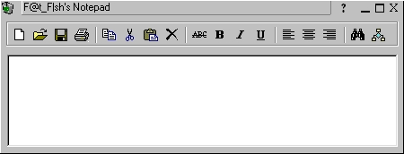



## Future Notepad Application

### Description

Its a simple Notepad with a few functions.But with the greatest controlls(e.g: flat 3d buttons, coolbar etc.)(Its still under construction)
 
### More Info
 

             |
---                |---
**Submitted On**   |2000-04-24 16:40:38
**By**             |[Loreno Heer](https://github.com/Planet-Source-Code/PSCIndex/blob/master/ByAuthor/loreno-heer.md)
**Level**          |Intermediate
**User Rating**    |4.2 (21 globes from 5 users)
**Compatibility**  |VB 5\.0, VB 6\.0
**Category**       |[Complete Applications](https://github.com/Planet-Source-Code/PSCIndex/blob/master/ByCategory/complete-applications__1-27.md)
**World**          |[Visual Basic](https://github.com/Planet-Source-Code/PSCIndex/blob/master/ByWorld/visual-basic.md)
**Archive File**   |[CODE\_UPLOAD51874252000\.zip](https://github.com/Planet-Source-Code/loreno-heer-future-notepad-application__1-7543/archive/master.zip)

### API Declarations

It's all in the zip file

